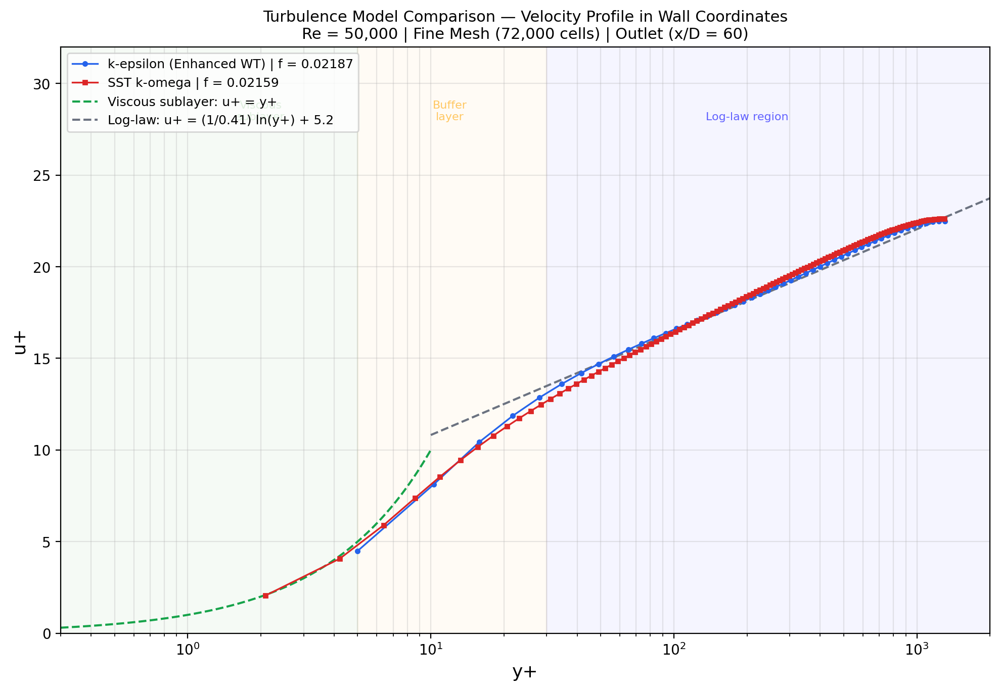
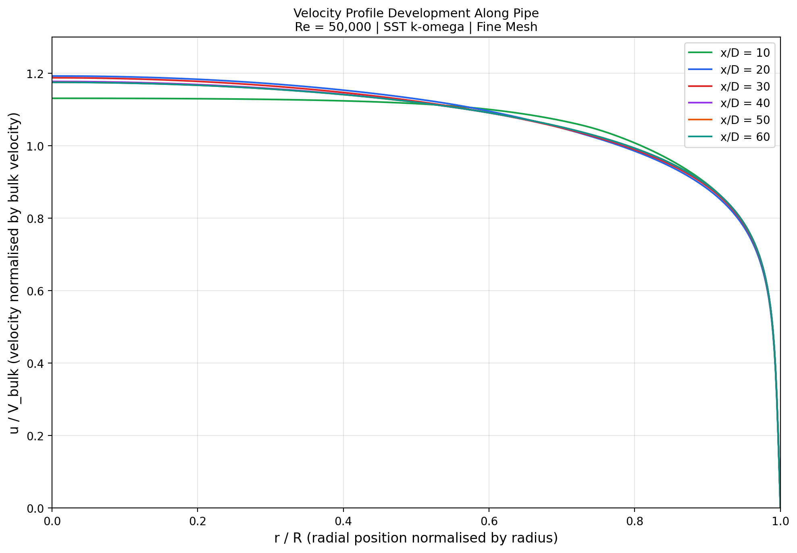
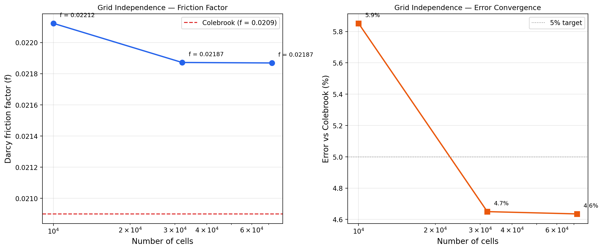

# Pipe Flow Validation — CFD Portfolio Project 1

Fully developed turbulent pipe flow simulation in ANSYS Fluent, validated against analytical correlations. This project demonstrates core CFD competencies: mesh generation, turbulence model selection, grid independence, and quantitative validation against known results.

## Problem Description

Incompressible, steady, fully developed turbulent flow through a smooth circular pipe at Re = 50,000. The analytical solution (Colebrook friction factor, law-of-the-wall velocity profile) is well-established, making this an ideal validation case — if CFD can't match a straight pipe, it can't be trusted for anything complex.

### Operating Conditions

| Parameter | Value |
|-----------|-------|
| Pipe diameter (D) | 50 mm |
| Pipe length (L) | 3 m (L/D = 60) |
| Reynolds number | 50,000 |
| Working fluid | Air (ρ = 1.225 kg/m³, μ = 1.789 × 10⁻⁵ Pa·s) |
| Bulk velocity | 14.6 m/s |
| Domain | 2D axisymmetric |

### Solver Setup

| Setting | Value |
|---------|-------|
| Solver | Pressure-based, steady, axisymmetric |
| P-V coupling | SIMPLE |
| Spatial discretization | Second-order upwind (all variables) |
| Near-wall y⁺ | ≈ 3 (resolves viscous sublayer) |

## Results Summary

### Friction Factor Validation

| Model | τ_w (Pa) | Darcy f | Error vs Colebrook |
|-------|----------|---------|-------------------|
| k-ε (Enhanced Wall Treatment) | 0.7138 | 0.02187 | 4.7% |
| SST k-ω | 0.7049 | 0.02159 | **3.3%** |
| Colebrook (analytical) | — | 0.02090 | reference |

SST k-ω outperforms standard k-ε by 1.4 percentage points at this mesh resolution (y⁺ ≈ 3).

### Grid Independence

| Mesh | Cells | f | Error | Change from previous |
|------|-------|------|-------|---------------------|
| Coarse (50 × 200) | 10,000 | 0.02213 | 5.9% | — |
| Medium (80 × 400) | 32,000 | 0.02188 | 4.7% | 1.1% |
| Fine (120 × 600) | 72,000 | 0.02187 | 4.7% | 0.05% |

Solution is grid-independent from the medium mesh onward (0.05% change medium → fine).

### Key Plots

**Turbulence Model Comparison (u⁺ vs y⁺)**

Both models follow the analytical log-law in the fully turbulent region (y⁺ > 30). SST k-ω tracks the log-law more closely and resolves the viscous sublayer better at this mesh resolution.



**Velocity Profile Development**

Flow becomes fully developed by x/D ≈ 20. Profiles at x/D = 40, 50, 60 are indistinguishable — confirming the pipe length (L/D = 60) is sufficient.



**Grid Independence**

Friction factor converges monotonically with mesh refinement. The medium-to-fine change is 0.05%, well below the 1–2% threshold for grid independence.



## Lessons Learned

### Wall Functions vs Enhanced Wall Treatment

The most important lesson from this project: **always match your wall treatment to your y⁺.**

Initial runs used standard k-ε with **standard wall functions**, which assume the first cell sits in the log-law region (y⁺ > 30). Our mesh had y⁺ ≈ 3 — deep inside the viscous sublayer. The result: wall shear stress was overpredicted by ~80%, giving a completely wrong friction factor (f ≈ 0.037 vs expected 0.021).

Switching to **Enhanced Wall Treatment** (which blends the viscous sublayer and log-law formulations across the full y⁺ range) immediately fixed the problem. This is not a bug — it's the physics. Standard wall functions use the log-law to estimate shear stress, and applying the log-law at y⁺ = 3 gives garbage because the log-law doesn't hold there.

**Rule: y⁺ < 5 → must resolve the sublayer (Enhanced WT or SST k-ω). y⁺ > 30 → wall functions are appropriate.**

### Why This Project Matters

Every validated CFD study starts with a case where the answer is already known. This pipe flow validates that the mesh, turbulence model, boundary conditions, and solver settings produce physically correct results. Without this baseline, results from more complex geometries (airfoils, nozzles, turbomachinery) cannot be trusted.

## Repository Structure

```
├── README.md                          # This file
├── docs/
│   └── lessons-learned.md             # Detailed discussion of findings
├── data/
│   ├── Axial_Vel_Kep_model.xy         # k-ε velocity profiles (Fluent export)
│   └── Vout_SST.xy                    # SST k-ω velocity profiles (Fluent export)
├── scripts/
│   ├── post_process_all.py            # Generates all plots
│   └── plot_u_plus_y_plus.py          # Single u+ vs y+ plot
├── figures/
│   ├── 01_u_plus_y_plus_comparison.png
│   ├── 02_velocity_development.png
│   └── 03_grid_independence.png
└── mesh-screenshots/
    └── (mesh images from ANSYS)
```

## How to Reproduce

1. Create 2D axisymmetric rectangle (3 m × 0.025 m) in ANSYS DesignModeler
2. Mesh with mapped face meshing, edge sizing with bias toward wall
3. Set boundary conditions: velocity inlet (14.6 m/s), pressure outlet, no-slip wall, axis
4. Run with k-ε (Enhanced WT) and SST k-ω on three mesh levels
5. Export velocity profiles and run `python scripts/post_process_all.py`

## Tools

- ANSYS Fluent 2024 R2
- Python 3.13 (numpy, matplotlib)
- SolidWorks (geometry)
